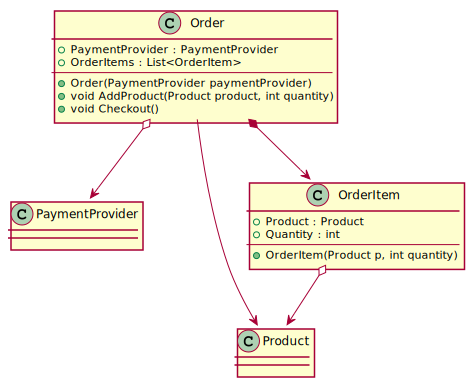
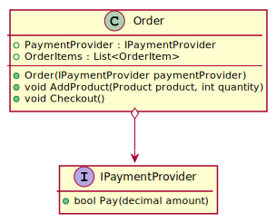
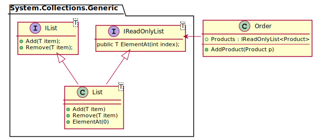

# Interfaces und Dependencies

## Was sind Dependencies (Abhängigkeiten) in der Softwareentwicklung?

Die Übersetzung von Dependencies (Abhängigkeiten) gibt schon Aufschluss darüber, was sich hinter
diesem Wort verbirgt. Dependencies im Klassenmodell bedeuten, dass eine Klasse eine andere 
Klasse verwendet, also von ihr abhängig ist. Dependencies im Klassenmodell zeigen sich also
durch Assoziationen oder Vererbung. Allgemein gesprochen: Brauche ich Klasse B, um die Klasse A
kompilieren zu können, besteht eine Dependency zwischen diesen Klassen.

## Arten von Assoziationen

Betrachten wir ein kleines Klassenmodell, wie wir es vom vorigen Beispiel schon kennen.
Wir sehen 3 Arten von Pfeilen: Pfeile ohne Diamond wie zwischen *Order* und *Product*. Pfeile
mit weißem Diamond wie zwischen *Order* und *PaymentProvider* und Pfeile mit gefülltem
Diamond wie zwischen *Order* und *OrderItem*.


<sup>
https://www.plantuml.com/plantuml/uml/RP7HIiOm38Nl-nIvtDI-WCYOU2K8paSeQy7Yrius7OpXknj9rytoxsRqoqbo3kaZge1fdiGugHXXKDji70x1hrQR87OGuYVN2EeqejWBUG-aUKKp4mFwxhC47Wynuu-a75hSY5l7J4h9jJAZEPgNXpyLVEUcbjOL4NWfkpByQkEmK2MWbHMfraPIlDc8JuLqSCDXKyzT_hzRrgxUQdZMEZiyC_6_JdRsl7oQySidR4fSk2Hbmk7hE5owezBb7hrncgxw2m00
</sup>

### Assoziation

Beschreibt, dass eine Klasse eine Andere verwendet. Dies ist am Typ der Felder, der
Methodenparameter oder Rückgabewerte erkennbar. Die Klasse *Order* verwendet den Typ *Product*, da in *AddProduct()* der Typ *Product* verwendet wird.
Daher besteht eine Assotiation zwischen *OrderItem* und *Product*. Es ist die allgemeinste Form,
alle hier abgebildeten Pfeile sind Assoziationen.

*Product* wird aber nicht in den Properties der Klasse *Order* gespeichert. Das ist zur Unterscheidung
zur Aggregation (nächster Punkt) wichtig.

### Aggregation

Die Aggregation ist eine Teilmenge der Assoziation. Es bedeutet *ist Teil von* oder *hat*.
Klasse B speichert also Instanzen von Klasse A als Feld oder Property.
Konkret bedeutet dies, dass wir uns die
Properties ansehen. Die Klasse *OrderItem* hat *Product* als Property. *OrderItem* speichert
also eine Instanz von *Product*, daher ist die Klasse *Product* Teil der Klasse *OrderItem*.

*Product* wird als Parameter im Konstruktor übergeben. Es wird also *extern instanziert*.
Gibt es die Instanz von *OrderItem* nicht mehr, existiert die Instanz von *Product* weiter.
Das ist für die Unterscheidung zum nächsten Punkt (Komposition) wichtig.

Jede Aggregation ist auch eine Assoziation. Im Klassendiagramm erkennen wir
die Aggregation durch das weiß gefüllte Diamond Symbol.

### Komposition

Die Komposition ist eine Teilmenge der Aggregation und die stärkste Bindungsart. Sie bedeutet
*existenzabhängig*. Konkret bedeutet das, dass die Instanzen von Klasse B innerhalb der Klassenmethoden von Klasse A mit new erzeugt werden. Klasse B kann daher nicht ohne Klasse A
existieren, da nur diese Klasse die Referenzen auf die Instanzen von B enthält (also
"existenzabhängig" ist).

In unserem Modell gilt diese Beziehung zwischen *Order* und *OrderItem*. In der Methode
*AddProduct()* wird mit new ein *OrderItem* erzeugt. *OrderItem* wird nicht von extern
über einen Konstruktor oder eine Methode hinzugegeben, sonst würden wir diesen Typ
als Parameter in den Klassenmethoden sehen. Gibt es die Instanz von *Order*
nicht mehr, sind auch alle *OrderItem* Instanzen nicht mehr zugreifbar und werden vom
Garbage Collector entfernt.

Jede Komposition ist auch eine Aggregation und eine Assoziation. Im Klassendiagramm
erkennen wir die Komposition durch das rot gefüllte Diamond Symbol.

### Pfeilrichtung beachten

Der Pfeil bedeutet *Navigierbarkeit*. Ich kann von *OrderItem* über das Property
*Product* zur Instanz des Produktes gelangen. Man bezeichnet das Property *Product* 
daher auch als *navigation property*. Der Diamond liegt auf der Seite des 
navigation property.

## Interfaces als Contract (Vertrag)

Betrachten wir eine Beispielimplementierung von *Checkout()* in der Klasse Order.

```c#
public void Checkout()
{
    if (!paymentProvider.Pay(totalAmount)) { /* payment failed */ }
    /* payment succeeded */
}
```

Wir sind eigentlich nur an der Methode *Pay()* interessiert, die uns der
PaymentProvider bietet. Wie sie konkret implementiert ist, kann uns egal sein.
Solange die Methode einen bool Wert zurückgibt und einen Parameter (Rechnungsbetrag) benötigt,
können wir sie auch ohne konkrete Implementierung nutzen.

Wir fordern aber im Konstruktor der Klasse Order eine konkrete Implementierung (also eine Instanz)
von PaymentProvider an. Eigentlich ist das nicht nötig. Daher können wir ein Interface
*IPaymentProvider* implementieren:

```c#
interface IPaymentProvider
{
    bool Pay(decimal amount);
}
```

Interfaces beginnen in .NET als Konvention mit einem großen I. Die Methoden haben
keine Sichtbarkeit, da bei einem Interface ohnehin klar ist, dass die Methode
öffentlich (public) sein muss. Sonst macht der "Vertrag" keinen Sinn, da ein Vertrag
ja auch zwischen 2 Personen ausgehandelt wird.

Nun können wir die Dependencies der Klasse Order besser gestalten:


<sup>
https://www.plantuml.com/plantuml/uml/POzTIaCn48NVPnNpcABPW4Yf-5GGx1PYPae7yrEJIQ68UpVcYjxUcvT3JhvpChEhwegs6E0an2X9kHoTPpmA1we0_yx-uAwHanvAldIsm2TWFtTlEGViRuROItG1NSmjwGQ-07nmjU9hcU6B5dnO5mzkXFRAiNRaHQe-_ZbR78YrTeQQPGsUR--R2Rva8NmYwZOrh-PNyJpfFKfI_6WkgUXrdda-iN_FJStFPkDBpDPkr-FlE56BuHi0
</sup>

Order verlangt nun im Konstruktor ein Argument vom Typ *IPaymentProvider*. Wie es
implementiert wird, kann der Orderklasse egal sein. Natürlich speichert dann das
Property *Order.PaymentProvider* ebenfalls den Typ *IPaymentProvider*.

Was bringt das nun?
- Ich kann - sobald ich das Interface *IPaymentProvider* implementiert habe (was ja
  schnell geht) - schon mit der Implementierung von Order beginnen.
- Im Team kann parallel dazu ein anderer Entwickler eine konkrete Implementierung von
  *IPaymentProvider* vornehmen.

Die konkrete Implementierung eines Interfaces könnte nun so aussehen. Dass *CreditCard*
als *PaymentProvider* ein Limit und ein Gültigkeitsdatum hat, ist für die *Checkout()* Methode
in *Order* ohne Bedeutung. Sie ruft nur die *Pay()* Methode auf.

```c#
interface IPaymentProvider
{
    bool Pay(decimal amount);
}

class CreditCard : IPaymentProvider
{
    public CreditCard(decimal limit, DateTime expiration)
    {
        Limit = limit;
        Expiration = expiration;
    }

    public decimal Limit { get; }
    public DateTime Expiration { get; }

    public bool Pay(decimal amount)
    {
        if (amount > Limit) { return false; }
        if (Expiration < DateTime.UtcNow) { return false; }
        return true;
    }
}
```

Interfaces können natürlich auch Properties enthalten. Wir können *get*, *set* oder
beides ins Interface legen. Häufig kommt die *get* Methode ins Interface, die Implementierung
hat dann auch eine set Methode.

```c#
interface IPaymentProvider
{
    string NotificationEmail { get; }
    bool Pay(decimal amount);
}

class CreditCard : IPaymentProvider
{
    /* ... */
    public string NotificationEmail { get; private set;  }
    public bool Pay(decimal amount) { /* omitted for clarity */ }
}
```

## Das Interface segregation principle

Das "I" in SOLID <sup>https://en.wikipedia.org/wiki/SOLID</sup> bedeutet
*Interface segregation principle*.
> "Many client-specific interfaces are better than one general-purpose interface."

Was bedeutet das? Sehen wir uns die Definition der Klasse *List&lt;T&gt;* in
System.Collections.Generic mit *F12* in Visual Studio genauer an.

```c#
public class List<T> : IList<T>, IReadOnlyList<T> // ...
{
    // ...
}
```

*List&lt;T&gt;* implementiert also mehrere Interfaces, unter anderem *IList&lt;T&gt;* und
*IReadOnlyList&lt;T&gt;*. Welchen Sinn hat das? Bereits im vorigen Beispiel haben wir intern
eine Liste zur Speicherung der
Produkte verwendet. Damit nicht ohne Prüfung Produkte eingefügt werden können, wurde ein public
Property vom Typ *IReadOnlyList&lt;T&gt;* definiert. 

Im Klassendiagramm könnte sich die Situation so darstellen (die Methoden in *IReadOnlyList&lt;T&gt;* sind andere, zur Veranschaulichung wird ElementAt definiert):


<sup>
https://www.plantuml.com/plantuml/uml/XP31IWCn48RlUOgXfoubnRDAQH4HGQZKVO6Op6fmabsIYLYqxsvC8qktWha4vf__usFMaLNWv4YyMeDWFMFeb4ReB9A9Ob3wJRqWp9xsaT4jRteYr6nx7vTtw35OFHEV0l8Rk_SxL6RhQVzW8r-tgnBdfVg6z4nMGmktX0uzRtYUkxblyAEvAck7AV5lqc9ZpBm5o-XAiKvtwFftF0qEedoQL8pmFsqAEv-FyXVDw5pG8DCWlrQdTpXFopHx7PssmM2efrmyXjuapH4k9yUimL5TIYb-nMimhpyCpG-wGFCUOSTIJet46hr9Zhu1
</sup>

Durch den Typecast regeln wir also die Funktionalität, die nach außen gegeben wird. Da die Liste
das Interface *IReadOnlyList&lt;Product&gt;* implementiert, ist ein impliziter Typecast möglich.
```c#
class Product { /* ... */ }
class Order
{
    private readonly List<Product> _products = new();
    public IReadOnlyList<Product> Products => _products;
}

Order order = new Order();
Product product = new Product(ean: "1001");
order.AddProduct(product);
order.Products.Remove(product);  // Compilerfehler: IReadOnlyList definiert kein Remove.
Product product2 = order.ElementAt(0);  // OK
```
