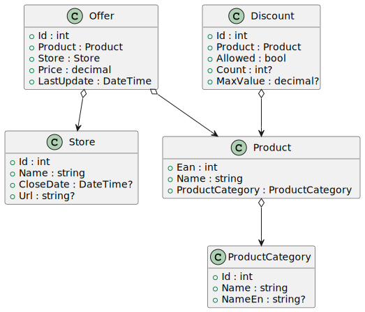

# Razor Pages 4a - DB Validation

## Inhalt

- Klasse Discount für die Speicherung der Informationen, ob für ein Produkt ein Rabatt gewährt werden darf und gegebenenfalls die Anzahl der gewährten Rabatte sowie der Maximalbetrag eines Rabattes.
- Formular für die Eingabe eines Rabattes auf den Preis im Angebot (Offer) für das ausgewählte Produkt in der Detail View für ein Geschäft (Store).
- Überprüfung hinsichtlich der in der Datenbank gespeicherten Daten, ob für das gewählte Produkt ein Angebot vorhanden ist bzw. ein Rabatt gewährt werden darf und gegebenenfalls der eingegebene Rabatt geringer als der Maximalbetrag für den Rabatt ist.
- Schlägt eine Überprüfung fehl, so wird eine entsprechende Fehlermeldung angezeigt.
- Sind alle Bedingungen erfüllt, dann wird der Preis des betreffenden Angebots um den Rabatt reduziert und der Count in der Tabelle Discount für das gegenständliche Produkt wird um 1 erhöht.

## Erweitertes Klassenmodell

https://www.plantuml.com/plantuml/uml/bP7FJiCm38VlVOhSqLwW1phKxO347oGOTzDuMoGddX97C27UdGOli5MJW5vQVt5__jpEaq2KxAdPEei6_KxsngDisQPc84Z9F0f7DE-D6Q-BQsjQuu9eTGSUnpf9T66Zg2TEk00flDoUdCTEZrQHlfkxvgCvvD-lrnZFvpz4jdcG4UdJ0QjHgsQrqmq5MHoS1r9u0qbMEtigypDuuTB0ESY_PbyHyIkMpXTcKjQN57stKt8BRyz0-SZeQs5TbMUpItK_1dLAjJgbgbpB7WGt7FT__2kAbk7Crw-9DMa9uPUegK8xbHgpbTGL9iTp33Px-WG0

