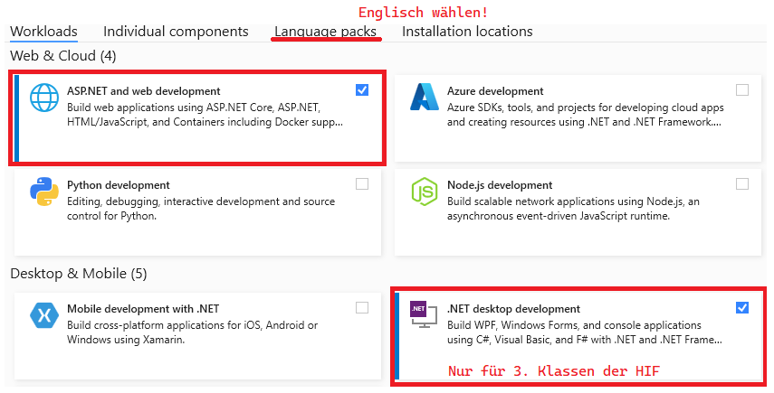

# POS

## Wichtiges zum Start

### Installation der IDE Visual Studio 2022

Die verbreitetste IDE zur Entwicklung im .NET Bereich ist Visual Studio. Microsoft stellt der
Schule eine Lizenz von Visual Studio Enterprise zur Verfügung.

- Lade die Testversion von Visual Studio **Enterprise** von https://visualstudio.microsoft.com/de/downloads/
  herunter.
- Installiere die nachfolgenden Workloads und achte bei den Sprachpaketen darauf, nur *Englisch* auszuwählen.
- Der Key wird im Unterricht ausgegeben.



### PlantUML und VS Code als Modellierungswerkzeug

In der Konzeptionierungsphase ist ein grafisches Tool zum Erzeugen von Klassenmodellen sehr wichtig.
In diesen Kurs werden immer wieder UML Klassendiagramme hergezeigt. Sie können mit VS Code und
PlantUML erzeugt werden:

1. Prüfe, ob Java installiert und im PATH eingetragen ist. Der Befehl *java -version* muss erkannt
   werden. Falls nicht, lade von https://openjdk.java.net/ die neuste Version von OpenJDK und
   füge den Pfad von java.exe im bin Verzeichnis der PATH Variable hinzu.
1. Installiere [Visual Studio Code](https://code.visualstudio.com). Achtung: Aktiviere beim Setup
   die Option "In den Explorer integrieren", damit Sie im Kontextmenü VS Code starten können.
1. Installiere die folgenden Extensions:
   - Markdown PDF
   - Markdown Preview Enhanced
   - PlantUML
1. Öffne die VS Code Konfiguration (*F1* - "*settings*" eingeben - "*Preferences: Open Settings (JSON)*" wählen)
   und füge folgende Zeilen hinzu:

```javascript
    "markdown-pdf.plantumlOpenMarker": "```plantuml",
    "markdown-pdf.plantumlCloseMarker": "```"   
```

Nun steht durch die Extension *Markdown Preview Enhanced* ein Icon bereit, welches eine Vorschau
mit dem gerenderten Diagramm bietet. Beachte: Dies ist nur bei Dokumenten mit der 
Endung *.md* Verfügbar.


Zum Testen kann nun eine neue Datei *Modell.md* mit folgendem Inhalt erstellt werden:

````
# Ein Klassenmodell

Das ist die Beschreibung.
```plantuml
@startuml

class Schoolclass {
   +Name : String
}

class Student {
   +Firstname : String
   +Schoolclass : Schoolclass
}

Student *--> Schoolclass
@enduml
```
````
## Weiterführende Unterlagen:

- YouTube Channels: [dotNET](https://www.youtube.com/channel/UCvtT19MZW8dq5Wwfu6B0oxw),
  [Nick Chapsas](https://www.youtube.com/channel/UCrkPsvLGln62OMZRO6K-llg),
  [NDC Conferences](https://www.youtube.com/channel/UCTdw38Cw6jcm0atBPA39a0Q)
- [C# 8.0 in a Nutshell: The Definitive Reference](https://www.amazon.de/C-8-0-Nutshell-Definitive-Reference-dp-1492051136/dp/1492051136/ref=dp_ob_title_bk)
- [Functional Programming in C#: How to write better C# code](https://www.amazon.de/Functional-Programming-C-Enrico-Buonanno/dp/1617293954/ref=sr_1_1?__mk_de_DE=%C3%85M%C3%85%C5%BD%C3%95%C3%91&crid=18ZFWZ2G0KO0J&dchild=1&keywords=functional+programming+c%23&qid=1600494628&sprefix=Functional+programmin%2Caps%2C174&sr=8-1)

## Synchronisieren des Repositories in einen Ordner

Installiere die neueste Version von [git](https://git-scm.com/downloads) mit den Standardeinstellungen.
Gehe danach in die Windows Eingabeaufforderung (cmd) und führe in einem geeigneten Ordner
(z. B. *C:\POS*) den Befehl
```
git clone https://github.com/balluch/POS.git
```

Soll der neueste Stand vom Server geladen werden, führe die Datei *resetGit.cmd* aus. Achtung:
alle lokalen Änderungen werden dabei zurückgesetzt.

